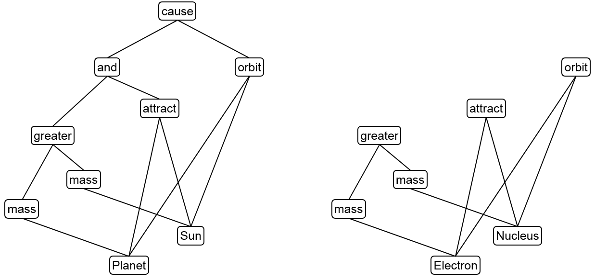
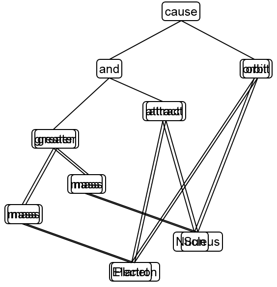
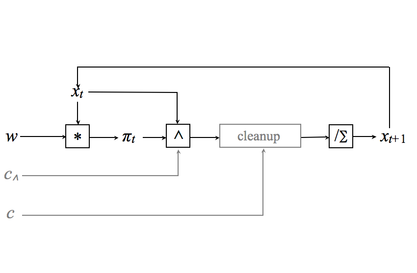
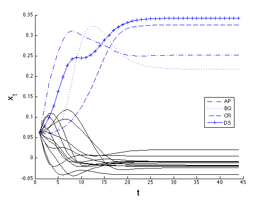

```{r LICENSE, include=FALSE}
# "VSA, Analogy, and Dynamic Similarity" (c) by Ross W. Gayler
# A presentation given at the Workshop on Developments in Hyperdimensional Computing and Vector Symbolic Architectures,
# 2020-03-16 in Heidelberg, Germany.
# 
# This document is licensed under a Creative Commons Attribution 4.0 International License.
# 
# You should have received a copy of the license along with this work.
# If not, see http://creativecommons.org/licenses/by/4.0/.
```


```{r setup, include=FALSE}
knitr::opts_chunk$set(cache=FALSE)

```

## Analogy as structure mapping

- Arguable that analogy is the core of cognition [@gust_analogical_2008; @blokpoel_deep_2018]
- Analogy commonly construed as *structure mapping* between *source* and *target* [@gentner_structure-mapping_1983]
  - Find maximal subgraph isomorphisms between *source* and *target* graphs
  - Find a mapping between *source* and *target* that makes maximal subpgraphs *identical*
  
{width=55%} \Huge $^{\longrightarrow}$ \normalsize {width=25%} 

## Similarity and generalistation

- Cognitive objective to generalise as widely and rapidly as possible

- Generalisation usually invokes/induces a concept of similarity

- Typical statistical/ML models use *literal* similarity
- Relational similarity typically encodes relations as literals
- Analogical similarity is based on relational structure (relations between relations)
  - Relational structures tend to reflect real causes in the environment (?)
  - Relational structures reduce reliance on "good" encoding of literals (?)
- Analogy includes literal similarity as a special case
  
## Static similarity in VSA
  
- Similarity (angle between vectors) is central to VSA [@Kanerva2009]
- Typically a \underline{fixed} mapping from "things" to vectors (representations)
- Emphasis on encodings that yield useful similarity structure [@Sahlgren2004; @purdy_encoding_2016]

- Representations may be learned ...
  - E.g. Random Indexing [@Sahlgren2004], vector embedding [@pennington_glove:_2014]
- but, are effectively fixed at time of use

## Human dynamic similarity

- Human similarity judgments known to be context-dependent [@cheng_context-dependent_1990]
- Arguable that similarity and analogy are based on the same processes [@gentner_structure_1997]
- Arguable that representations are created on-the-fly in response to task demands [@chalmers_high-level_1992]

- Doesn’t necessarily imply that base representations are context-dependent
- Could have dynamic *working* representations
derived from the static base representations by context-dependent transforms

## Substitution as a dynamic transformation

- An obvious candidate for a dynamic transformation function in VSA is substitution by binding
  - The substitution mapping can be specified as a vector
  - The substitution mapping vector can be dynamically generated [@Kanerva2009]
  
- This implies an internal degree of freedom (a register to hold the substitution vector while it evolves) ...
- and a recurrent VSA circuit to provide the dynamics to evolve the substitution vector

## Maximal subgraph isomorphism circuit

- Maximal subgraph isomorphism circuit [@Gayler2009]
  - Finds the maximal subgraph isomorphism between two graphs represented as vectors
  - Implemented as a recurrent VSA circuit with a register containing a vertex substitution vector that
    evolves and settles over the course of the computation
  - Final state of substitution vector represents the set of vertex substitutions that best transforms each static
    graph into the other graph

{width=35%} \hspace{20pt} {width=31%}

\vspace{10pt}
You can't see this because it's off the bottom of the slide


## Connections

- The subgraph isomorphism circuit can be interpreted as related
to the recently developed Resonator Circuits for factorisation of VSA representations [@kent_resonator_2019]
  - They have internal degrees of freedom for each of the factors to be calculated
  - Recurrent VSA dynamics that settles on the factorisation
  
- Subgraph isomorphism circuit can be interpreted as finding the square root of the product of the two graphs

- Alternatively, find a factor (the substitution vector) 
  such that the product of that factor with each of the graphs 
  is a good approximation to the other graph
  - This links the VSA representation factorisation back to statistical modelling
  - Long history of approximating matrices/tensors as the product of simpler factors [@kolda_tensor_2009].

## Future work

Lots to do:

- Subgraph isomorphism circuit takes two graphs,
  analogical memory takes a query graph and a memory stocked with *many* graphs
- Hypergraphs rather than graphs
  (suggestion that cognitive relations are rank up to 4 or 5)
- Make *thoroughly* distributed
  (avoid localist components)

## Resources

\tiny

The video of this presentation given on 2020-05-18 is archived on Zenodo at  
https://doi.org/10.5281/zenodo.3835154

The slides of this presentation are archived on Zenodo at  
https://doi.org/10.5281/zenodo.3700835

The source code of this presentation is publicly accessible on GitHub at  
https://github.com/rgayler/VSA_2020_presentation

The extended abstract of this presentation is publicly accessible on GitHub at  
https://github.com/rgayler/VSA_2020_presentation/raw/master/VSA2020_Gayler_abstract.pdf

\vspace{100pt}   

{width=10%}
This presentation is licensed under a
[Creative Commons Attribution 4.0 International License](http://creativecommons.org/licenses/by/4.0/)

\normalsize

## References

\tiny
\setlength{\parskip}{0.5em}

